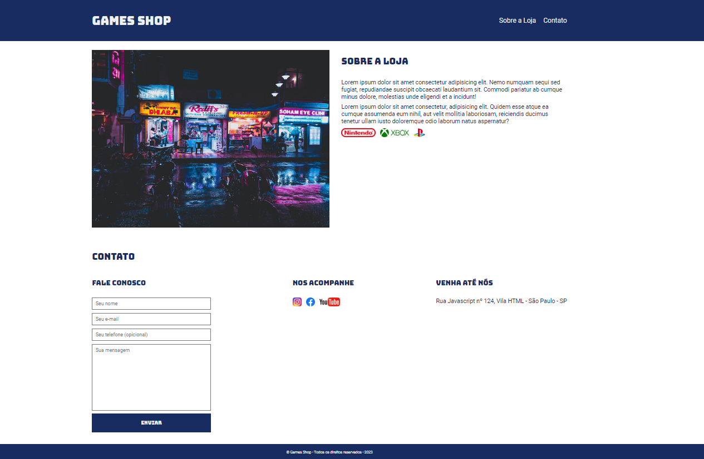

<h1 align="center"> Landing Page - Game Shop </h1>

Projeto pessoal de uma landing page de uma loja de games

  <a href="#-tecnologias">Tecnologias</a>&nbsp;&nbsp;&nbsp;|&nbsp;&nbsp;&nbsp;
  <a href="#-projeto">Projeto</a>&nbsp;&nbsp;&nbsp;|&nbsp;&nbsp;&nbsp;
  <a href="#memo-licença">Licença</a>

  

 

  

## 🚀 Tecnologias

Esse projeto foi desenvolvido com as seguintes tecnologias:

- HTML e CSS
- Git e Github

## 💻 Projeto

Game Shop é uma loja virtual de games.

- [Visite o projeto online](https://site-gameshop-nu-lime.vercel.app/)

## :memo: Licença

Esse projeto está sob a licença MIT.
